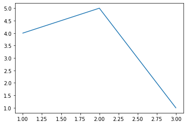
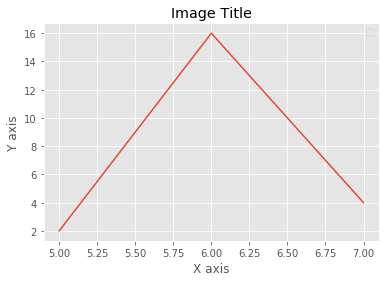
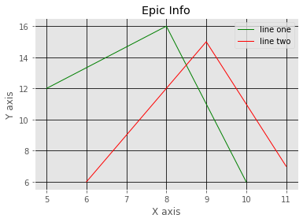
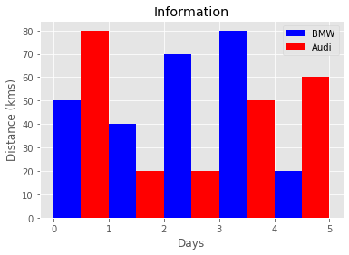
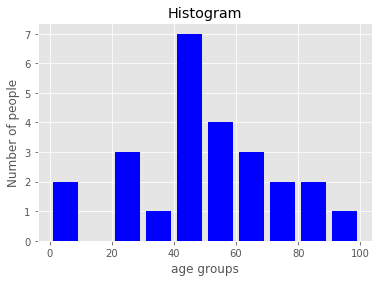
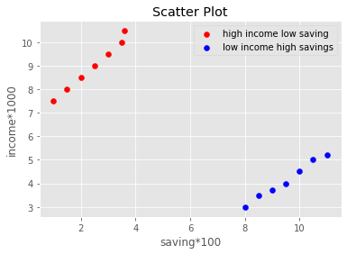
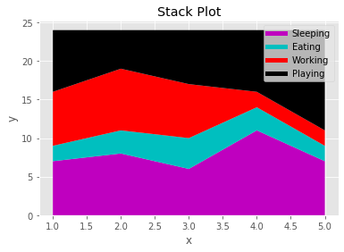
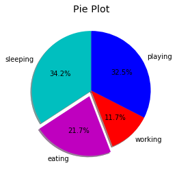
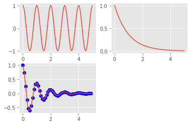

```python
from matplotlib import pyplot as plt
%matplotlib inline
```


```python
plt.plot([1,2,3],[4,5,1])
plt.show()
```





```python
from matplotlib import pyplot as plt
x = [5,6,7]
y = [2,16,4]
plt.plot(x,y)
#图片的标题
plt.title('Image Title')
#坐标轴Y轴
plt.ylabel('Y axis')
#坐标轴X轴
plt.xlabel('X axis')
plt.legend()
plt.show()
```

    No handles with labels found to put in legend.
    





```python
from matplotlib import pyplot as pltfrom 
from matplotlib import style 
style.use('ggplot')
x = [5,8,10]
y = [12,16,6]
x2 = [6,9,11]
y2 = [6,15,7]
plt.plot(x,y,'g',label='line one', linewidth=1)
plt.plot(x2,y2,'r',label='line two',linewidth=1)
plt.title('Epic Info')
plt.ylabel('Y axis')
plt.xlabel('X axis')
#设置图例位置
plt.legend()
plt.grid(True,color='k')
plt.show()
```





```python
from matplotlib import pyplot as plt 
plt.bar([.25,1.25,2.25,3.25,4.25],[50,40,70,80,20],label="BMW", color='b', width=.5)
plt.bar([.75,1.75,2.75,3.75,4.75],[80,20,20,50,60],label="Audi", color='r',width=.5)
plt.legend()
plt.xlabel('Days')
plt.ylabel('Distance (kms)')
plt.title('Information')
plt.show()
```





```python
import matplotlib.pyplot as plt
# 数据
population_age = [22,55,62,45,21,22,34,42,42,4,2,102,95,85,55,110,120,70,65,55,111,115,80,75,65,54,44,43,42,48]
# 组距
bins = [0,10,20,30,40,50,60,70,80,90,100]
# 声明方法参数 plt.hist(数据,组距,类型,颜色,宽度)
plt.hist(population_age, bins, histtype='bar', color='b', rwidth=0.8)
plt.xlabel('age groups')
plt.ylabel('Number of people')
plt.title('Histogram')
plt.show()
```





```python
import matplotlib.pyplot as plt
x = [1,1.5,2,2.5,3,3.5,3.6]
y = [7.5,8,8.5,9,9.5,10,10.5] 
x1=[8,8.5,9,9.5,10,10.5,11]
y1=[3,3.5,3.7,4,4.5,5,5.2]
plt.scatter(x,y, label='high income low saving',color='r')
plt.scatter(x1,y1,label='low income high savings',color='b')
plt.xlabel('saving*100')
plt.ylabel('income*1000')
plt.title('Scatter Plot')
plt.legend()
plt.show()                                                                                            
```





```python
import matplotlib.pyplot as plt
days = [1,2,3,4,5]
sleeping =[7,8,6,11,7]
eating = [2,3,4,3,2]
working =[7,8,7,2,2]
playing = [8,5,7,8,13]
plt.plot([],[],color='m', label='Sleeping', linewidth=5)
plt.plot([],[],color='c', label='Eating', linewidth=5)
plt.plot([],[],color='r', label='Working', linewidth=5)
plt.plot([],[],color='k', label='Playing', linewidth=5)
plt.stackplot(days, sleeping,eating,working,playing, colors=['m','c','r','k'])
plt.xlabel('x')
plt.ylabel('y')
plt.title('Stack Plot')
plt.legend()
plt.show()
```





```python
import matplotlib.pyplot as plt
days = [1,2,3,4,5]
sleeping =[7,8,6,11,7]
eating = [2,3,4,3,2]
working =[7,8,7,2,2]
playing = [8,5,7,8,13]
print(sum(playing),sum(working),sum(eating),sum(sleeping))
slices = [sum(playing),sum(working),sum(eating),sum(sleeping)]
activities = ['sleeping','eating','working','playing']
cols = ['c','m','r','b']
plt.pie(slices,  labels=activities,  colors=cols,  startangle=90,  shadow= True,  explode=(0,0.1,0,0),  autopct='%1.1f%%')
plt.title('Pie Plot')
plt.show()
```

    41 26 14 39
    





```python
import numpy as np
import matplotlib.pyplot as plt
def f(t):
    return np.exp(-t) * np.cos(2*np.pi*t)
t1 = np.arange(0.0, 5.0, 0.1)
t2 = np.arange(0.0, 5.0, 0.02)
t3 = np.arange(0.0, 5.0, 0.02)
plt.subplot(223)
plt.plot(t1, f(t1), 'bo', t2, f(t2))
plt.subplot(221)
plt.plot(t2, np.cos(2*np.pi*t2))
plt.subplot(222)
plt.plot(t3, np.exp(-t3))
plt.show()
```





```python

```
