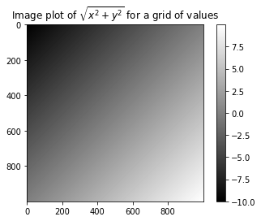
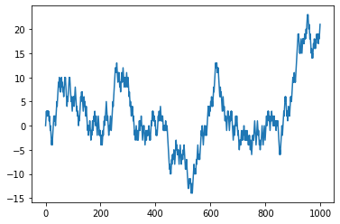
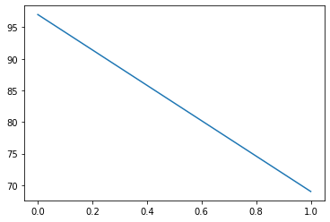

```python
import numpy as np
```


```python
# create array by numpy
data = {1,3,4,5,5,6}
array1 = np.array(data)
print(array1)
```

    {1, 3, 4, 5, 6}
    


```python
# create mul array
data = [[1,3],[2,3]]
array2 = np.array(data)
print(array2)
```

    [[1 3]
     [2 3]]
    


```python
# ndim or shape
print(array1.ndim,array2.ndim,"\n")
print(array1.shape,array2.shape,"\n")
```

    0 2 
    
    () (2, 2) 
    
    


```python
# other array
print(np.zeros(10))
print(np.ones(10))
print(np.empty((2,3)))
```

    [0. 0. 0. 0. 0. 0. 0. 0. 0. 0.]
    [1. 1. 1. 1. 1. 1. 1. 1. 1. 1.]
    [[70. 75. 80.]
     [85. 90. 95.]]
    


```python
print(np.arange(15))
```

    [ 0  1  2  3  4  5  6  7  8  9 10 11 12 13 14]
    


```python
a = np.array([[10,11,12],[0,0,0],[13,14,15],[16,17,18]])
b = np.array([[1,2,3]])
print(a)
print(b)
```

    [[10 11 12]
     [ 0  0  0]
     [13 14 15]
     [16 17 18]]
    [[1 2 3]]
    


```python
print(a+b)
```

    [[11 13 15]
     [ 1  2  3]
     [14 16 18]
     [17 19 21]]
    


```python
print(b+a)
```

    [[11 13 15]
     [ 1  2  3]
     [14 16 18]
     [17 19 21]]
    


```python
arr1 = np.arange(15)
arr1[:] = 1
print(arr1[:])
```

    [1 1 1 1 1 1 1 1 1 1 1 1 1 1 1]
    


```python
arr3d = np.array([[[1,2,3],[2,3,4]],[[12,23,34],[23,34,5]]])
print(arr3d,",")
print(arr3d[1],",")
print(arr3d[1,1],",")
print(arr3d[1,1,1])
```

    [[[ 1  2  3]
      [ 2  3  4]]
    
     [[12 23 34]
      [23 34  5]]] ,
    [[12 23 34]
     [23 34  5]] ,
    [23 34  5] ,
    34
    


```python
# ->矢量化计算
names = np.array(['a','b','c','d'])
print(names == 'a')
```

    [ True False False False]
    


```python
data = np.random.randn(4,4)
print(data)
```

    [[-0.08111788  0.89443497 -1.03731891 -1.12591623]
     [-1.18704841  3.14023157  0.21688604  0.23992125]
     [ 0.9223491   0.06893124  1.78803358 -0.67175557]
     [ 0.7152371   1.11391368  0.04949814  0.98613761]]
    


```python
print(names=='b')
print(data[names=='b'])
print(data[names=='b',2:])
```

    [False  True False False]
    [[-1.18704841  3.14023157  0.21688604  0.23992125]]
    [[0.21688604 0.23992125]]
    


```python
print(names!='b')
print(data[~(names=='b')])
```

    [ True False  True  True]
    [[-0.08111788  0.89443497 -1.03731891 -1.12591623]
     [ 0.9223491   0.06893124  1.78803358 -0.67175557]
     [ 0.7152371   1.11391368  0.04949814  0.98613761]]
    


```python
cond1 = (names == 'a') | (names == 'c')
print(cond1)
print(data[cond1])
```

    [ True False  True False]
    [[-0.08111788  0.89443497 -1.03731891 -1.12591623]
     [ 0.9223491   0.06893124  1.78803358 -0.67175557]]
    


```python
print(data)
```

    [[-0.08111788  0.89443497 -1.03731891 -1.12591623]
     [-1.18704841  3.14023157  0.21688604  0.23992125]
     [ 0.9223491   0.06893124  1.78803358 -0.67175557]
     [ 0.7152371   1.11391368  0.04949814  0.98613761]]
    


```python
data[data<0] = 0
print(data)
```

    [[0.         0.89443497 0.         0.        ]
     [0.         3.14023157 0.21688604 0.23992125]
     [0.9223491  0.06893124 1.78803358 0.        ]
     [0.7152371  1.11391368 0.04949814 0.98613761]]
    


```python
data[names != 'a'] = 1
print(data)
```

    [[0.         0.89443497 0.         0.        ]
     [1.         1.         1.         1.        ]
     [1.         1.         1.         1.        ]
     [1.         1.         1.         1.        ]]
    


```python
# flower index -- it will return a new array
arr = np.empty((8, 4))
for i in range(8):
    arr[i] = i
print(arr)
```

    [[0. 0. 0. 0.]
     [1. 1. 1. 1.]
     [2. 2. 2. 2.]
     [3. 3. 3. 3.]
     [4. 4. 4. 4.]
     [5. 5. 5. 5.]
     [6. 6. 6. 6.]
     [7. 7. 7. 7.]]
    


```python
print(arr[1])
print(arr[[4,3,2,1]])
# index < 0
print(arr[[-3,-2,-1]])
```

    [1. 1. 1. 1.]
    [[4. 4. 4. 4.]
     [3. 3. 3. 3.]
     [2. 2. 2. 2.]
     [1. 1. 1. 1.]]
    [[5. 5. 5. 5.]
     [6. 6. 6. 6.]
     [7. 7. 7. 7.]]
    


```python
# complex index array
arr = np.arange(32).reshape((8,4))
print(arr)
print(arr[[1,2,3,4],[0,1,2,3]])# the first array is row, the second array is the col index one by one.
print(arr[[1,2,3,4]][:,[0,1,2,3]])
```

    [[ 0  1  2  3]
     [ 4  5  6  7]
     [ 8  9 10 11]
     [12 13 14 15]
     [16 17 18 19]
     [20 21 22 23]
     [24 25 26 27]
     [28 29 30 31]]
    [ 4  9 14 19]
    [[ 4  5  6  7]
     [ 8  9 10 11]
     [12 13 14 15]
     [16 17 18 19]]
    


```python
# array's T
arr = np.arange(15).reshape((3,5))
print(arr)
print(arr.T)
```

    [[ 0  1  2  3  4]
     [ 5  6  7  8  9]
     [10 11 12 13 14]]
    [[ 0  5 10]
     [ 1  6 11]
     [ 2  7 12]
     [ 3  8 13]
     [ 4  9 14]]
    


```python
# cal the product of the array
print(np.dot(arr.T,arr))
```

    [[125 140 155 170 185]
     [140 158 176 194 212]
     [155 176 197 218 239]
     [170 194 218 242 266]
     [185 212 239 266 293]]
    


```python
# the special operation is a complex thing to understand and you need to review it when you need to use it.
```


```python
# sqrt and exp
arr = np.arange(10)
print(arr)
print(np.sqrt(arr))
print(np.exp(arr))
```

    [0 1 2 3 4 5 6 7 8 9]
    [0.         1.         1.41421356 1.73205081 2.         2.23606798
     2.44948974 2.64575131 2.82842712 3.        ]
    [1.00000000e+00 2.71828183e+00 7.38905610e+00 2.00855369e+01
     5.45981500e+01 1.48413159e+02 4.03428793e+02 1.09663316e+03
     2.98095799e+03 8.10308393e+03]
    


```python
# compare x and y's items one by one (index)
x = np.random.randn(8)
y = np.random.randn(8)

print(x)
print(y)
print(np.maximum(x,y))
```

    [ 0.65240612 -1.82926881 -0.33318012  0.42421357  1.77937488 -0.10563151
      0.03149596  0.4351418 ]
    [-1.3363795  -1.47966908 -0.03248144  0.44178907  0.35376739 -1.49341555
     -0.02062335 -1.14623632]
    [ 0.65240612 -1.47966908 -0.03248144  0.44178907  1.77937488 -0.10563151
      0.03149596  0.4351418 ]
    


```python
# return the int or float of nums
arr = np.random.randn(7) * 5
print(arr)

remainder, whole_part = np.modf(arr)
print(remainder) # float
print(whole_part) # negative and positive integer
```

    [-12.90685996  -6.39210909  -1.82434803  -3.09816226  -8.40124863
      -8.5040376    3.22646631]
    [-0.90685996 -0.39210909 -0.82434803 -0.09816226 -0.40124863 -0.5040376
      0.22646631]
    [-12.  -6.  -1.  -3.  -8.  -8.   3.]
    


```python
# direct operations on origin numpy array
arr = np.random.randn(7)
print(arr)
print(np.sqrt(arr))
print(np.sqrt(arr,arr))
print(arr)
```

    [-0.55296441  0.325798    0.44486744  0.75431965 -1.11731742 -0.13403981
     -0.31220389]
    [       nan 0.57078717 0.66698383 0.86851577        nan        nan
            nan]
    [       nan 0.57078717 0.66698383 0.86851577        nan        nan
            nan]
    [       nan 0.57078717 0.66698383 0.86851577        nan        nan
            nan]
    

    D:\Anaconda3\lib\site-packages\ipykernel_launcher.py:4: RuntimeWarning: invalid value encountered in sqrt
      after removing the cwd from sys.path.
    D:\Anaconda3\lib\site-packages\ipykernel_launcher.py:5: RuntimeWarning: invalid value encountered in sqrt
      """
    


```python
# more ufuncs are in the dictionary and if you need to use it , please search it 
```


```python
# data anaysis
# create x and y
points = np.arange(-5,5,0.01) # 1000 equally spaced points
xs, ys = np.meshgrid(points, points)
print(xs,ys)
```

    [[-5.   -4.99 -4.98 ...  4.97  4.98  4.99]
     [-5.   -4.99 -4.98 ...  4.97  4.98  4.99]
     [-5.   -4.99 -4.98 ...  4.97  4.98  4.99]
     ...
     [-5.   -4.99 -4.98 ...  4.97  4.98  4.99]
     [-5.   -4.99 -4.98 ...  4.97  4.98  4.99]
     [-5.   -4.99 -4.98 ...  4.97  4.98  4.99]] [[-5.   -5.   -5.   ... -5.   -5.   -5.  ]
     [-4.99 -4.99 -4.99 ... -4.99 -4.99 -4.99]
     [-4.98 -4.98 -4.98 ... -4.98 -4.98 -4.98]
     ...
     [ 4.97  4.97  4.97 ...  4.97  4.97  4.97]
     [ 4.98  4.98  4.98 ...  4.98  4.98  4.98]
     [ 4.99  4.99  4.99 ...  4.99  4.99  4.99]]
    


```python
# calculate the pow(pow(x,2)+pow(y,2),0.5)
z = np.sqrt(xs**2+ys**2)
z2 = xs + ys
print(z2)
```

    [[-1.00000000e+01 -9.99000000e+00 -9.98000000e+00 ... -3.00000000e-02
      -2.00000000e-02 -1.00000000e-02]
     [-9.99000000e+00 -9.98000000e+00 -9.97000000e+00 ... -2.00000000e-02
      -1.00000000e-02 -2.13162821e-13]
     [-9.98000000e+00 -9.97000000e+00 -9.96000000e+00 ... -1.00000000e-02
      -2.13162821e-13  1.00000000e-02]
     ...
     [-3.00000000e-02 -2.00000000e-02 -1.00000000e-02 ...  9.94000000e+00
       9.95000000e+00  9.96000000e+00]
     [-2.00000000e-02 -1.00000000e-02 -2.13162821e-13 ...  9.95000000e+00
       9.96000000e+00  9.97000000e+00]
     [-1.00000000e-02 -2.13162821e-13  1.00000000e-02 ...  9.96000000e+00
       9.97000000e+00  9.98000000e+00]]
    


```python
import matplotlib.pyplot as plt
%matplotlib inline

plt.imshow(z2,cmap=plt.cm.gray);plt.colorbar()
plt.title("Image plot of $\sqrt{x^2 + y^2}$ for a grid of values")
```


    Text(0.5, 1.0, 'Image plot of $\\sqrt{x^2 + y^2}$ for a grid of values')





```python
# exchange expression to array calculate
```


```python
xarr = np.array([1.1,1.2,1.3,1.4,1.5])
yarr = np.array([2.1,2.2,2.3,2.4,2.5])
cond = np.array([True,False,True,True,False])
result = [(x if c else y)
          for x,y,c in zip(xarr,yarr,cond)]
print(result)
```

    [1.1, 2.2, 1.3, 1.4, 2.5]
    


```python
result = np.where(cond,xarr,yarr) # coder qucker tool
print(result)
```

    [1.1 2.2 1.3 1.4 2.5]
    


```python
# application 1: replace nagative to -2 , positive to +2
arr = np.random.randn(4,4)
print(arr)
print(arr > 0)
print(np.where(arr > 0, 2, -2))
print(np.where(arr > 0, 2, arr)) # not change the origin array
```

    [[ 0.11087151 -1.09878543  0.67686278 -1.22165545]
     [-0.52117426  1.63487537 -0.70580866  0.61865378]
     [-1.09543752  0.59811228  0.84921605  1.44168171]
     [ 0.80491157 -1.26409163 -0.39345761 -0.52875365]]
    [[ True False  True False]
     [False  True False  True]
     [False  True  True  True]
     [ True False False False]]
    [[ 2 -2  2 -2]
     [-2  2 -2  2]
     [-2  2  2  2]
     [ 2 -2 -2 -2]]
    [[ 2.         -1.09878543  2.         -1.22165545]
     [-0.52117426  2.         -0.70580866  2.        ]
     [-1.09543752  2.          2.          2.        ]
     [ 2.         -1.26409163 -0.39345761 -0.52875365]]
    


```python
arr = np.random.randn(5,4)
```


```python
print(arr)
print(arr.mean(0)) # axis = 1计算每行的平均值并把每一行的平均值作为一维数组的值返回; axis = 0: 每列
# check method : 
# print(np.sum(arr[0,:])/4) 每行
# print(np.sum(arr[:,0])/5) 每列
# 所有值的平均值
print(arr.mean()) 
print(np.mean(arr))
# check method : print(np.sum(arr[:,:])/(4*5))
print(arr.sum()) # 计算所有值的和 print(np.sum(arr[:,:]))
```

    [[-0.34560116 -0.84243961 -0.50635131  0.60840764]
     [ 0.12753344  0.79030418 -0.9415171   0.72082147]
     [ 1.59284335 -0.53969859 -0.91440401  0.718694  ]
     [ 0.80932434 -0.80893003 -1.47908922 -1.02002783]
     [-1.35986818 -0.56047977 -1.33694638 -1.02398755]]
    [ 1.64846357e-01 -3.92248763e-01 -1.03566160e+00  7.81546857e-04]
    -0.3155706156886077
    -0.3155706156886077
    -6.311412313772155
    


```python
arr = np.arange(9)
print(arr)
print(arr.cumsum()) # 累加函数，每个数是对应其位置以及其前边所有值之和
```

    [0 1 2 3 4 5 6 7 8]
    [ 0  1  3  6 10 15 21 28 36]
    


```python
arr = np.array([[0,1,2],[3,4,5],[6,7,8]])
print(arr)
print(arr.cumsum(axis=0)) # 列
print(arr.cumsum(axis=1)) # 行
# 累积
print(arr.cumprod(axis=0))
```

    [[0 1 2]
     [3 4 5]
     [6 7 8]]
    [[ 0  1  2]
     [ 3  5  7]
     [ 9 12 15]]
    [[ 0  1  3]
     [ 3  7 12]
     [ 6 13 21]]
    [[ 0  1  2]
     [ 0  4 10]
     [ 0 28 80]]
    


```python
# more array statistics mothods you need to search them
```


```python
arr = np.random.randn(100)
```


```python
print(arr)
print((arr>0).sum())
```

    [ 8.35281666e-01  1.18196886e+00 -1.38314511e+00 -1.54734255e+00
      4.78361885e-01 -1.81263333e-01  2.08820077e-01 -6.79556803e-01
      6.17925346e-01 -8.15551212e-01  6.93828281e-01 -2.24276700e-01
      4.98889796e-01 -1.01160855e-01 -1.13568288e+00 -7.89151522e-02
     -1.47538149e+00 -8.95600432e-01 -7.20597953e-02  9.28409801e-01
     -2.01844547e+00  4.45997429e-01 -1.02247821e+00 -2.72901912e-01
     -5.74676579e-01  8.70093778e-01  3.09682211e-01 -4.38679615e-01
     -1.49617389e-01  1.29588157e+00 -7.95920505e-01 -1.34045063e+00
     -1.13774750e+00 -2.55839208e-03  6.93501788e-01  9.02095353e-01
     -7.32032964e-02 -5.52460884e-01 -1.62534532e+00  6.13572024e-02
      2.50689522e-02 -2.27210735e+00 -1.19936595e+00  1.94505319e+00
     -1.25186725e+00 -6.00233520e-01 -7.69823660e-01  2.19828448e-01
     -3.13759944e-01  7.87257379e-01 -3.77492607e-01  1.01184770e+00
     -3.89431357e-01 -1.76210318e+00 -2.05211391e+00  8.69731300e-02
      1.14782817e+00  4.62149554e-01  1.03716587e+00 -1.85828777e+00
      3.46296207e-01 -1.23590646e+00  1.95078620e+00  2.13190049e-01
     -2.84860114e-01  1.79370904e+00  7.42190029e-01  2.69717974e-01
      1.87544407e+00  3.96301587e-01  5.87778995e-01 -7.44722420e-01
      4.74156545e-01  1.38270800e+00 -1.83273032e-01  2.03748824e+00
      1.15178537e+00  5.63229758e-03 -3.47456027e-01  6.62154513e-01
     -9.14554345e-03  4.18171297e-01 -1.92703522e-01  9.98654835e-02
      6.19433351e-01  1.41287743e+00 -1.45431880e+00  4.22854238e-02
     -2.60321566e-01  8.41909268e-01 -4.74828230e-01  7.31270072e-01
      8.73776670e-01 -2.38575210e-01 -5.06006393e-01  3.15963854e-01
     -2.75088397e+00  3.24319976e-01  9.65157273e-01  1.55189423e+00]
    51
    


```python
# search for true and false
bools = np.array([False,False,True,False])
print(bools.any()) # isExist()
print(bools.all()) # isAll()
# isNotZore can be applicated ,too
```

    True
    False
    


```python
# sort
array = np.random.random(5)
```


```python
# quicker sort
print(array)
print(np.sort(array,kind='mergesort')) # 默认为quicksort
# 注意方法中有四个参数，不能直接跳过某个参数除了直接声明
# np.sort(a,axis,kind,order)
```

    [0.84351651 0.16661546 0.75976068 0.62313136 0.43652458]
    [0.16661546 0.43652458 0.62313136 0.75976068 0.84351651]
    


```python
# 排序字段
dt = np.dtype([('name','S10'),('age',int)])
a = np.array([("raju",21),("anil",25),("ravi",17),("amar",27)],dtype=dt)
print(a)
print(np.sort(a,order = 'name'))
```

    [(b'raju', 21) (b'anil', 25) (b'ravi', 17) (b'amar', 27)]
    [(b'amar', 27) (b'anil', 25) (b'raju', 21) (b'ravi', 17)]
    


```python
arr = np.random.randn(5,3)
print(arr)
```

    [[ 0.80957423 -0.6491237  -0.88643384]
     [-2.06435326 -0.70352539 -1.24859542]
     [-0.39480448  0.80628067  0.01213912]
     [ 0.11013363  0.74319259 -0.46744695]
     [-0.2028557  -0.21722372 -1.15425958]]
    


```python
print(np.sort(arr)) # 默认为排序行方向上的元素
arr.sort(0)
print(arr)
arr.sort(1)
print(arr)
```

    [[-0.88643384 -0.6491237   0.80957423]
     [-2.06435326 -1.24859542 -0.70352539]
     [-0.39480448  0.01213912  0.80628067]
     [-0.46744695  0.11013363  0.74319259]
     [-1.15425958 -0.21722372 -0.2028557 ]]
    [[-2.06435326 -0.70352539 -1.24859542]
     [-0.39480448 -0.6491237  -1.15425958]
     [-0.2028557  -0.21722372 -0.88643384]
     [ 0.11013363  0.74319259 -0.46744695]
     [ 0.80957423  0.80628067  0.01213912]]
    [[-2.06435326 -1.24859542 -0.70352539]
     [-1.15425958 -0.6491237  -0.39480448]
     [-0.88643384 -0.21722372 -0.2028557 ]
     [-0.46744695  0.11013363  0.74319259]
     [ 0.01213912  0.80628067  0.80957423]]
    


```python
# 使用指定排序类型返回数据的索引数组，将排序后的元素的索引返回一个数组
```


```python
x = np.array([1,5,6,3,2,4])
print(x)
y = np.argsort(x)
print(y)
print(x[y])
for i in y:
    print(x[i])
```

    [1 5 6 3 2 4]
    [0 4 3 5 1 2]
    [1 2 3 4 5 6]
    1
    2
    3
    4
    5
    6
    


```python
nm = ('raju','anil','ravi','amar')
dv = ('f.y.','s.y.','s.y.','f.y.')
ind = np.lexsort((dv,nm))
print(ind)
print([nm[i] for i in ind])
print([dv[i] for i in ind])
```

    [3 1 0 2]
    ['amar', 'anil', 'raju', 'ravi']
    ['f.y.', 's.y.', 'f.y.', 's.y.']
    


```python
# 集合运算：返回集合中排序好的唯一值|
names = np.array(['Bob','Joe','Will','Bob','Will','Joe','Joe'])
print(np.unique(names))
ints = np.array([1,2,3,5,6,7,3,4,5])
print(np.unique(ints))
```

    ['Bob' 'Joe' 'Will']
    [1 2 3 4 5 6 7]
    


```python
print(sorted(set(names)))
```

    ['Bob', 'Joe', 'Will']
    


```python
values = np.array([6,0,0,3,2,5,6])
print(np.in1d(values,[2,3,6])) # 1 与 l ??????
```

    [ True False False  True  True False  True]
    


```python
# if you need more methods, you should search for them.Knowledge can't automatically crush into your mind
```


```python
# io
arr = np.arange(10)
np.save('test_np_io_array',arr)
print(np.load('test_np_io_array.npy'))
```

    [0 1 2 3 4 5 6 7 8 9]
    


```python
arr1 = np.arange(10)
arr2 = np.arange(5)
np.savez('array_archive.npz',a=arr1,b=arr2)
arch = np.load('array_archive.npz')
print(arch['a'])
print(arch['b'])
```

    [0 1 2 3 4 5 6 7 8 9]
    [0 1 2 3 4]
    


```python
# zip data although i don't know what is this?
np.savez_compressed('arrays_compressed.npz',a=arr1,b=arr2)
```


```python
# 线性代数
x = np.array([[1.,2.,3.],[4.,5.,5.]])
y = np.array([[6.,23.],[-1,7],[8,9]])

print(x)
print(y)
print(x.dot(y))
```

    [[1. 2. 3.]
     [4. 5. 5.]]
    [[ 6. 23.]
     [-1.  7.]
     [ 8.  9.]]
    [[ 28.  64.]
     [ 59. 172.]]
    


```python
print(np.dot(x,y))
```

    [[ 28.  64.]
     [ 59. 172.]]
    


```python
# 二维数组和一个大小合适的一维数组的矩阵点积运算以后将会得到一个一维数组
print(np.ones(3))
print(np.dot(x,np.ones(3)))
```

    [1. 1. 1.]
    [ 6. 14.]
    


```python
# 矩阵乘法
print(x @ np.ones(3))
```

    [ 6. 14.]
    


```python
from numpy.linalg import inv, qr
X = np.random.randn(5,5)
mat = X.T.dot(X)
print(X)
print('\n')
print(mat) # 转置乘积
print('\n')
print(inv(mat)) # 逆矩阵
print('\n')
print(mat.dot(inv(mat)))# 转置乘积后与逆矩阵相乘
```

    [[ 1.24473773 -2.03182926  2.36275903  1.677622    0.09508335]
     [-0.007194   -0.03819969  0.50746804  0.92731183  0.92782726]
     [-0.72195015  0.33716002  0.7943397   0.22572775  0.09674008]
     [ 1.10374344  0.07805815 -0.3369983   0.498758   -0.04858546]
     [ 1.40846794 -0.41860311 -0.48835691 -0.35079514  0.86681387]]
    
    
    [[ 5.27266728 -3.27566534  1.3040962   1.97498129  1.20909118]
     [-3.27566534  4.42478789 -4.37416621 -3.18218206 -0.56266243]
     [ 1.3040962  -4.37416621  6.82318991  4.61693478  0.36540488]
     [ 1.97498129 -3.18218206  4.61693478  4.0970926   0.71342955]
     [ 1.20909118 -0.56266243  0.36540488  0.71342955  1.63298974]]
    
    
    [[ 1.48690466  2.02692215  1.74075673 -1.04571654 -0.33519273]
     [ 2.02692215  3.41479026  2.71813416 -1.32638481 -0.35290906]
     [ 1.74075673  2.71813416  2.89055251 -1.96043726 -0.14264006]
     [-1.04571654 -1.32638481 -1.96043726  1.9433549  -0.09310146]
     [-0.33519273 -0.35290906 -0.14264006 -0.09310146  0.81154987]]
    
    
    [[ 1.00000000e+00 -2.81228086e-15 -6.45477279e-16 -8.32910142e-16
      -1.11023987e-16]
     [ 6.63591772e-16  1.00000000e+00  2.25075650e-15 -3.28703663e-16
       1.97508563e-16]
     [-4.68101033e-16 -5.29445256e-16  1.00000000e+00  1.94805623e-15
      -1.39807932e-16]
     [-1.08858514e-15 -1.18827260e-15 -2.15399762e-15  1.00000000e+00
       7.18006700e-17]
     [ 2.35319598e-18 -1.70044845e-16 -2.46480272e-16 -1.56257913e-16
       1.00000000e+00]]
    


```python
# 求熟悉的上三角
q, r = qr(mat)
print(r)
```

    [[-6.75234205  6.58068137 -5.87390765 -5.30369939 -1.78874173]
     [ 0.         -4.07180129  7.29788048  4.73555952 -0.13101645]
     [ 0.          0.         -1.03811098 -1.40726171 -0.83900083]
     [ 0.          0.          0.         -0.32083227  0.2921108 ]
     [ 0.          0.          0.          0.          1.04001686]]
    


```python
# cool mehtods 
samples = np.random.normal(size=(3,3))
print(samples)
```

    [[-0.20315796  0.18328311 -0.49875001]
     [-2.44300158  0.30913653 -0.67993364]
     [-0.94568599 -0.44012219 -0.64130566]]
    


```python
# origin random
from random import normalvariate

N = 100000
%timeit samples = [normalvariate(0,1) for _ in range(N)]
%timeit np.random.normal(size=N)
```

    84.7 ms ± 1.78 ms per loop (mean ± std. dev. of 7 runs, 10 loops each)
    2.71 ms ± 30.8 µs per loop (mean ± std. dev. of 7 runs, 100 loops each)
    


```python
# random seed np.random.seed(1234)
# seperate the seed 
rng2 = np.random.RandomState(124)
print(rng2.randn(10))
```

    [ 0.28847906 -0.46295408 -1.33800442  2.31701567 -1.46737593 -0.74854769
     -1.01752136  1.6350668   0.92254561 -0.71988132]
    


```python
# if you need more methods, you need to search them from computer.
```


```python
# The last: create random nums and print them
import random
import matplotlib.pyplot as plt
%matplotlib inline

position = 0
walk = [position]
steps = 1000
for i in range(steps):
    step = 1 if random.randint(0,1) else -1
    position += step
    walk.append(position)
```


```python
plt.plot(walk[:1000]) # print method of matlab
```


    [<matplotlib.lines.Line2D at 0x2c3f18c8d68>]





```python
nstemps = 10000 # 模拟10000 次 投掷硬币结果
draws = np.random.randint(0,2,size=nstemps)
steps = np.where(draws > 0, 1, -1)
walk = steps.cumsum()
```


```python
print(walk.min())
print(walk.max())
```

    -20
    192
    


```python
# 想知道一开始需要多久才能到达规定值
print((np.abs(walk) >= 10).argmax())
```

    65
    


```python
# 利用二元数组模拟多个随机漫步
nwalks = 500 # first
nsteps = 100 # second
draws = np.random.randint(0,2,size=(nwalks,nsteps))
steps = np.where(draws > 0, 1, -1)
walks = steps.cumsum(1)
print(draws)
print('\n')
print(walk)
```

    [[1 1 1 ... 1 1 1]
     [0 0 1 ... 1 0 1]
     [1 0 1 ... 1 0 0]
     ...
     [0 0 0 ... 1 1 0]
     [0 0 0 ... 1 0 1]
     [1 0 1 ... 0 0 0]]
    
    
    [ -1  -2  -3 ... 180 181 182]
    


```python
print(walks.max())
print(walks.min())
```

    32
    -30
    


```python
hits30 = (np.abs(walks) >= 30).any(1)
print(hits30)
print(hits30.sum())
```

    [False False False False False False False False False False False False
     False False False False False False False False False False False False
     False False False False False False False False False False False False
     False False False False False False False False False False False False
     False False False False False False False False False False False False
     False False False False False False False False False  True False False
     False False False False False False False False False False False False
     False False False False False False False False False False False False
     False False False False False False False False False False False False
     False False False False False False False False False False False False
     False False False False False False False False False False False False
     False False False False  True False False False False False False False
     False False False False False False False False False False False False
     False False False False False False False False False False False False
     False False False False False False False False False False False False
     False False False False False False False False False False False False
     False False False False False False False False False False False False
     False False False False False False False False False False False False
     False False False False False False False False False False False False
     False False False False False False False False False False False False
     False False False False False False False False False False False False
     False False False False False False False False False False False False
     False False False False False False False False False False False False
     False False False False False False False False False False False False
     False False False False False False False False False False False False
     False False False False False False False False False False False False
     False False False False False False False False False False False False
     False False False False False False False False False False False False
     False False False False False False False False False False False False
     False False False False False False False False False False False False
     False False False False False False False False False False False False
     False False False False False False False False False False False False
     False False False False False False False False False False False False
     False False False False False False False False False False False False
     False False False False False False False False False False False False
     False False False False False False False False False False False False
     False False False False False False False False False False False False
     False False False False False False False False False False False False
     False False False False False False False False False False False False
     False False False False False False False False False False False False
     False False False False False False False False False False False False
     False False False False False False False False]
    2
    


```python
crossing_times = (np.abs(walks[hits30]) >= 30).argmax(1)
print(crossing_times.mean())
plt.plot(crossing_times[:])
```

    83.0
    


    [<matplotlib.lines.Line2D at 0x2c3f16091d0>]





```python
# other methods also can be used to create random nums
steps = np.random.normal(loc=0,scale=0.25,size=(nwalks,nsteps))
print(steps)
```

    [[-0.4263687   0.19302543  0.22412612 ... -0.17004294  0.02577186
      -0.12970539]
     [ 0.40639905 -0.04870713 -0.12056732 ...  0.08732779  0.27452643
      -0.3447095 ]
     [ 0.07959268 -0.2948711  -0.19610765 ...  0.03819389  0.28470069
      -0.15279262]
     ...
     [ 0.28873103 -0.07730687  0.08960117 ... -0.3166941  -0.48810155
       0.21499935]
     [ 0.24755919  0.07434758 -0.41529902 ...  0.01699111 -0.2309645
      -0.13303157]
     [ 0.07484343  0.08576656 -0.28622256 ... -0.17826977 -0.17981803
       0.28075841]]
    


```python
# 小结
# 主要是各种方法要熟练掌握
# 正确处理好各个方面
```
