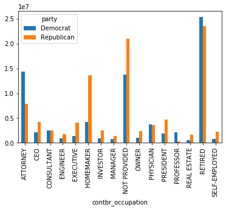
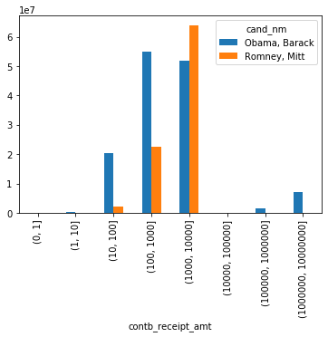
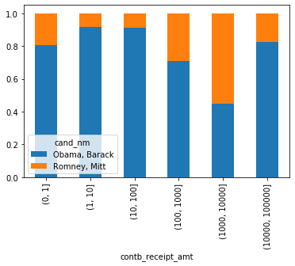
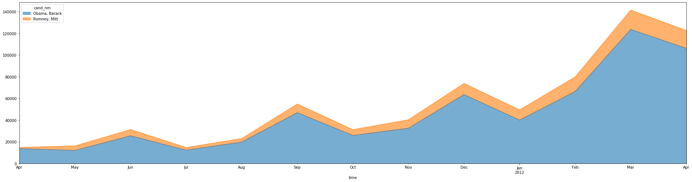

```python
%matplotlib inline
import numpy as np
import pandas as pd
import matplotlib.pyplot as plt
```

## 导入数据集


```python
data = pd.read_csv('data/Practice_01.csv')
data.head()
```

    D:\Anaconda3\lib\site-packages\IPython\core\interactiveshell.py:3057: DtypeWarning: Columns (6) have mixed types. Specify dtype option on import or set low_memory=False.
      interactivity=interactivity, compiler=compiler, result=result)
    


<div>
<style scoped>
    .dataframe tbody tr th:only-of-type {
        vertical-align: middle;
    }

    .dataframe tbody tr th {
        vertical-align: top;
    }

    .dataframe thead th {
        text-align: right;
    }
</style>
<table border="1" class="dataframe">
  <thead>
    <tr style="text-align: right;">
      <th></th>
      <th>cmte_id</th>
      <th>cand_id</th>
      <th>cand_nm</th>
      <th>contbr_nm</th>
      <th>contbr_city</th>
      <th>contbr_st</th>
      <th>contbr_zip</th>
      <th>contbr_employer</th>
      <th>contbr_occupation</th>
      <th>contb_receipt_amt</th>
      <th>contb_receipt_dt</th>
      <th>receipt_desc</th>
      <th>memo_cd</th>
      <th>memo_text</th>
      <th>form_tp</th>
      <th>file_num</th>
    </tr>
  </thead>
  <tbody>
    <tr>
      <td>0</td>
      <td>C00410118</td>
      <td>P20002978</td>
      <td>Bachmann, Michelle</td>
      <td>HARVEY, WILLIAM</td>
      <td>MOBILE</td>
      <td>AL</td>
      <td>3.6601e+08</td>
      <td>RETIRED</td>
      <td>RETIRED</td>
      <td>250.0</td>
      <td>20-JUN-11</td>
      <td>NaN</td>
      <td>NaN</td>
      <td>NaN</td>
      <td>SA17A</td>
      <td>736166</td>
    </tr>
    <tr>
      <td>1</td>
      <td>C00410118</td>
      <td>P20002978</td>
      <td>Bachmann, Michelle</td>
      <td>HARVEY, WILLIAM</td>
      <td>MOBILE</td>
      <td>AL</td>
      <td>3.6601e+08</td>
      <td>RETIRED</td>
      <td>RETIRED</td>
      <td>50.0</td>
      <td>23-JUN-11</td>
      <td>NaN</td>
      <td>NaN</td>
      <td>NaN</td>
      <td>SA17A</td>
      <td>736166</td>
    </tr>
    <tr>
      <td>2</td>
      <td>C00410118</td>
      <td>P20002978</td>
      <td>Bachmann, Michelle</td>
      <td>SMITH, LANIER</td>
      <td>LANETT</td>
      <td>AL</td>
      <td>3.68633e+08</td>
      <td>INFORMATION REQUESTED</td>
      <td>INFORMATION REQUESTED</td>
      <td>250.0</td>
      <td>05-JUL-11</td>
      <td>NaN</td>
      <td>NaN</td>
      <td>NaN</td>
      <td>SA17A</td>
      <td>749073</td>
    </tr>
    <tr>
      <td>3</td>
      <td>C00410118</td>
      <td>P20002978</td>
      <td>Bachmann, Michelle</td>
      <td>BLEVINS, DARONDA</td>
      <td>PIGGOTT</td>
      <td>AR</td>
      <td>7.24548e+08</td>
      <td>NONE</td>
      <td>RETIRED</td>
      <td>250.0</td>
      <td>01-AUG-11</td>
      <td>NaN</td>
      <td>NaN</td>
      <td>NaN</td>
      <td>SA17A</td>
      <td>749073</td>
    </tr>
    <tr>
      <td>4</td>
      <td>C00410118</td>
      <td>P20002978</td>
      <td>Bachmann, Michelle</td>
      <td>WARDENBURG, HAROLD</td>
      <td>HOT SPRINGS NATION</td>
      <td>AR</td>
      <td>7.19016e+08</td>
      <td>NONE</td>
      <td>RETIRED</td>
      <td>300.0</td>
      <td>20-JUN-11</td>
      <td>NaN</td>
      <td>NaN</td>
      <td>NaN</td>
      <td>SA17A</td>
      <td>736166</td>
    </tr>
  </tbody>
</table>
</div>


```python
data.info() # information
```

    <class 'pandas.core.frame.DataFrame'>
    RangeIndex: 1001731 entries, 0 to 1001730
    Data columns (total 16 columns):
    cmte_id              1001731 non-null object
    cand_id              1001731 non-null object
    cand_nm              1001731 non-null object
    contbr_nm            1001731 non-null object
    contbr_city          1001712 non-null object
    contbr_st            1001727 non-null object
    contbr_zip           1001620 non-null object
    contbr_employer      988002 non-null object
    contbr_occupation    993301 non-null object
    contb_receipt_amt    1001731 non-null float64
    contb_receipt_dt     1001731 non-null object
    receipt_desc         14166 non-null object
    memo_cd              92482 non-null object
    memo_text            97770 non-null object
    form_tp              1001731 non-null object
    file_num             1001731 non-null int64
    dtypes: float64(1), int64(1), object(14)
    memory usage: 122.3+ MB
    


```python
data.describe()
```


<div>
<style scoped>
    .dataframe tbody tr th:only-of-type {
        vertical-align: middle;
    }

    .dataframe tbody tr th {
        vertical-align: top;
    }

    .dataframe thead th {
        text-align: right;
    }
</style>
<table border="1" class="dataframe">
  <thead>
    <tr style="text-align: right;">
      <th></th>
      <th>contb_receipt_amt</th>
      <th>file_num</th>
    </tr>
  </thead>
  <tbody>
    <tr>
      <td>count</td>
      <td>1.001731e+06</td>
      <td>1.001731e+06</td>
    </tr>
    <tr>
      <td>mean</td>
      <td>2.982352e+02</td>
      <td>7.744948e+05</td>
    </tr>
    <tr>
      <td>std</td>
      <td>3.749667e+03</td>
      <td>1.059822e+04</td>
    </tr>
    <tr>
      <td>min</td>
      <td>-3.080000e+04</td>
      <td>7.235110e+05</td>
    </tr>
    <tr>
      <td>25%</td>
      <td>3.500000e+01</td>
      <td>7.719270e+05</td>
    </tr>
    <tr>
      <td>50%</td>
      <td>1.000000e+02</td>
      <td>7.792250e+05</td>
    </tr>
    <tr>
      <td>75%</td>
      <td>2.500000e+02</td>
      <td>7.802340e+05</td>
    </tr>
    <tr>
      <td>max</td>
      <td>2.014491e+06</td>
      <td>7.878030e+05</td>
    </tr>
  </tbody>
</table>
</div>


## 清洗数据
### 填补不存在的数据


```python
data['contbr_employer'].fillna('NOT PROVIDED',inplace=True)
data['contbr_occupation'].fillna('NOT PROVIDED',inplace=True)
```


```python
print('共有{}位候选人，分别是'.format(len(data['cand_nm'].unique())))
data['cand_nm'].unique()
```

    共有13位候选人，分别是
    


    array(['Bachmann, Michelle', 'Romney, Mitt', 'Obama, Barack',
           "Roemer, Charles E. 'Buddy' III", 'Pawlenty, Timothy',
           'Johnson, Gary Earl', 'Paul, Ron', 'Santorum, Rick',
           'Cain, Herman', 'Gingrich, Newt', 'McCotter, Thaddeus G',
           'Huntsman, Jon', 'Perry, Rick'], dtype=object)


## 通过搜索引擎等途径，获取到每个总统候选人的所属党派，建立字典parties，候选人名字作为键，所属党派作为对应的值


```python
parties = {'Bachmann, Michelle': 'Republican',
           'Cain, Herman': 'Republican',
           'Gingrich, Newt': 'Republican',
           'Huntsman, Jon': 'Republican',
           'Johnson, Gary Earl': 'Republican',
           'McCotter, Thaddeus G': 'Republican',
           'Obama, Barack': 'Democrat',
           'Paul, Ron': 'Republican',
           'Pawlenty, Timothy': 'Republican',
           'Perry, Rick': 'Republican',
           "Roemer, Charles E. 'Buddy' III": 'Republican',
           'Romney, Mitt': 'Republican',
           'Santorum, Rick': 'Republican'}
```

### 通过map映射函数，增加一列party存储党派信息


```python
data['party']=data['cand_nm'].map(parties)
```

## 查看两个党派的情况


```python
data['party'].value_counts()
```


    Democrat      593746
    Republican    407985
    Name: party, dtype: int64


```python
data.groupby('contbr_occupation')['contb_receipt_amt'].sum().sort_values(ascending=False)[:20]
```


    contbr_occupation
    RETIRED                                   48176447.00
    ATTORNEY                                  18470473.30
    HOMEMAKER                                 17484807.65
    INFORMATION REQUESTED PER BEST EFFORTS    15859514.55
    INFORMATION REQUESTED                      8742357.59
    PHYSICIAN                                  7224044.40
    PRESIDENT                                  6347843.59
    EXECUTIVE                                  5273717.90
    CONSULTANT                                 4932627.98
    NOT PROVIDED                               4224760.39
    CEO                                        3570942.20
    LAWYER                                     3537982.19
    OWNER                                      3278488.16
    INVESTOR                                   3204481.92
    ENGINEER                                   2730527.43
    PROFESSOR                                  2458033.81
    C.E.O.                                     2433218.11
    SELF-EMPLOYED                              2259150.94
    MANAGER                                    2167571.47
    REAL ESTATE                                2110499.34
    Name: contb_receipt_amt, dtype: float64


## 职业的分析
### 建立一个职业对应字典，把相同职业的不同表达映射为对应的职业，比如把C.E.O.映射为CEO


```python
occupation_map = {
  'INFORMATION REQUESTED PER BEST EFFORTS':'NOT PROVIDED',
  'INFORMATION REQUESTED':'NOT PROVIDED',
  'SELF' : 'SELF-EMPLOYED',
  'SELF EMPLOYED' : 'SELF-EMPLOYED',
  'C.E.O.':'CEO',
  'LAWYER':'ATTORNEY',
}

# 如果不在字典中,返回x
f = lambda x: occupation_map.get(x, x)
data.contbr_occupation = data.contbr_occupation.map(f)
```

## 雇主信息转换


```python
emp_mapping = {
   'INFORMATION REQUESTED PER BEST EFFORTS' : 'NOT PROVIDED',
   'INFORMATION REQUESTED' : 'NOT PROVIDED',
   'SELF' : 'SELF-EMPLOYED',
   'SELF EMPLOYED' : 'SELF-EMPLOYED',
}

# If no mapping provided, return x
f = lambda x: emp_mapping.get(x, x)
data.contbr_employer = data.contbr_employer.map(f)
```

### 筛选出出资额为正的部分


```python
data = data[data['contb_receipt_amt']>0]
```

### 查看各候选人获得的赞助总金额


```python
data.groupby('cand_nm')['contb_receipt_amt'].sum().sort_values(ascending=False)
```


    cand_nm
    Obama, Barack                     1.358774e+08
    Romney, Mitt                      8.833591e+07
    Paul, Ron                         2.100962e+07
    Perry, Rick                       2.030575e+07
    Gingrich, Newt                    1.283277e+07
    Santorum, Rick                    1.104316e+07
    Cain, Herman                      7.101082e+06
    Pawlenty, Timothy                 6.004819e+06
    Huntsman, Jon                     3.330373e+06
    Bachmann, Michelle                2.711439e+06
    Johnson, Gary Earl                5.669616e+05
    Roemer, Charles E. 'Buddy' III    3.730099e+05
    McCotter, Thaddeus G              3.903000e+04
    Name: contb_receipt_amt, dtype: float64


### 发现第一名和第二名绝对优势，所以聚集分析他们


```python
data_vs = data[data['cand_nm'].isin(['Obama, Barack','Romney, Mitt'])].copy()
```

### 利用cut函数根据出资额大小将数据离散化到多个面元中：


```python
bins = np.array([0,1,10,100,1000,10000,100000,1000000,10000000])
labels = pd.cut(data_vs['contb_receipt_amt'],bins)
labels
```


    411         (10, 100]
    412       (100, 1000]
    413       (100, 1000]
    414         (10, 100]
    415         (10, 100]
                 ...     
    701381      (10, 100]
    701382    (100, 1000]
    701383        (1, 10]
    701384      (10, 100]
    701385    (100, 1000]
    Name: contb_receipt_amt, Length: 694282, dtype: category
    Categories (8, interval[int64]): [(0, 1] < (1, 10] < (10, 100] < (100, 1000] < (1000, 10000] < (10000, 100000] < (100000, 1000000] < (1000000, 10000000]]


### 过滤总出资不足200万美院的数据：
### 按照党派、职业对赞助金额进行汇总，类似excel中的透视表操作，聚合函数为sum


```python
by_occupation = data.pivot_table('contb_receipt_amt',index='contbr_occupation',columns='party',aggfunc='sum')
```

### 过滤掉赞助金额小于200W的数据


```python
over_2mm = by_occupation[by_occupation.sum(1)>2000000]
over_2mm
```


<div>
<style scoped>
    .dataframe tbody tr th:only-of-type {
        vertical-align: middle;
    }

    .dataframe tbody tr th {
        vertical-align: top;
    }

    .dataframe thead th {
        text-align: right;
    }
</style>
<table border="1" class="dataframe">
  <thead>
    <tr style="text-align: right;">
      <th>party</th>
      <th>Democrat</th>
      <th>Republican</th>
    </tr>
    <tr>
      <th>contbr_occupation</th>
      <th></th>
      <th></th>
    </tr>
  </thead>
  <tbody>
    <tr>
      <td>ATTORNEY</td>
      <td>14302461.84</td>
      <td>7.868419e+06</td>
    </tr>
    <tr>
      <td>CEO</td>
      <td>2074974.79</td>
      <td>4.211041e+06</td>
    </tr>
    <tr>
      <td>CONSULTANT</td>
      <td>2459912.71</td>
      <td>2.544725e+06</td>
    </tr>
    <tr>
      <td>ENGINEER</td>
      <td>951525.55</td>
      <td>1.818374e+06</td>
    </tr>
    <tr>
      <td>EXECUTIVE</td>
      <td>1355161.05</td>
      <td>4.138850e+06</td>
    </tr>
    <tr>
      <td>HOMEMAKER</td>
      <td>4248875.80</td>
      <td>1.363428e+07</td>
    </tr>
    <tr>
      <td>INVESTOR</td>
      <td>884133.00</td>
      <td>2.431769e+06</td>
    </tr>
    <tr>
      <td>MANAGER</td>
      <td>762883.22</td>
      <td>1.444532e+06</td>
    </tr>
    <tr>
      <td>NOT PROVIDED</td>
      <td>13725187.32</td>
      <td>2.097161e+07</td>
    </tr>
    <tr>
      <td>OWNER</td>
      <td>1001567.36</td>
      <td>2.408287e+06</td>
    </tr>
    <tr>
      <td>PHYSICIAN</td>
      <td>3735124.94</td>
      <td>3.594320e+06</td>
    </tr>
    <tr>
      <td>PRESIDENT</td>
      <td>1878509.95</td>
      <td>4.720924e+06</td>
    </tr>
    <tr>
      <td>PROFESSOR</td>
      <td>2165071.08</td>
      <td>2.967027e+05</td>
    </tr>
    <tr>
      <td>REAL ESTATE</td>
      <td>528902.09</td>
      <td>1.625902e+06</td>
    </tr>
    <tr>
      <td>RETIRED</td>
      <td>25305116.38</td>
      <td>2.356124e+07</td>
    </tr>
    <tr>
      <td>SELF-EMPLOYED</td>
      <td>741746.40</td>
      <td>2.245273e+06</td>
    </tr>
  </tbody>
</table>
</div>


```python
over_2mm.plot(kind='bar')
```


    <matplotlib.axes._subplots.AxesSubplot at 0x134769eca58>





### 由于职业和雇主的处理非常相似，我们定义函数get_top_amounts()对两个字段进行分析处理


```python
def get_top_amounts(group,key,n=5):
#传入groupby分组后的对象，返回按照key字段汇总的排序前n的数据
    totals = group.groupby(key)['contb_receipt_amt'].sum()
    return totals.sort_values(ascending=False)[:n]
  
grouped = data_vs.groupby('cand_nm')
grouped.apply(get_top_amounts,'contbr_occupation',n=7)
```


    cand_nm        contbr_occupation
    Obama, Barack  RETIRED              25305116.38
                   ATTORNEY             14302461.84
                   NOT PROVIDED         13725187.32
                   HOMEMAKER             4248875.80
                   PHYSICIAN             3735124.94
                   CONSULTANT            2459912.71
                   PROFESSOR             2165071.08
    Romney, Mitt   NOT PROVIDED         11638509.84
                   RETIRED              11508473.59
                   HOMEMAKER             8147446.22
                   ATTORNEY              5372424.02
                   PRESIDENT             2491244.89
                   CEO                   2324297.03
                   EXECUTIVE             2300947.03
    Name: contb_receipt_amt, dtype: float64


### 同样的，使用get_top_amounts()对雇主进行分析处理


```python
grouped.apply(get_top_amounts,'contbr_employer',n=10)
```


    cand_nm        contbr_employer   
    Obama, Barack  RETIRED               22694358.85
                   SELF-EMPLOYED         18626807.16
                   NOT PROVIDED          13883494.03
                   NOT EMPLOYED           8586308.70
                   HOMEMAKER              2605408.54
                   STUDENT                 318831.45
                   VOLUNTEER               257104.00
                   MICROSOFT               215585.36
                   SIDLEY AUSTIN LLP       168254.00
                   REFUSED                 149516.07
    Romney, Mitt   NOT PROVIDED          12321731.24
                   RETIRED               11506225.71
                   HOMEMAKER              8147196.22
                   SELF-EMPLOYED          7414115.22
                   STUDENT                 496490.94
                   CREDIT SUISSE           281150.00
                   MORGAN STANLEY          267266.00
                   GOLDMAN SACH & CO.      238250.00
                   BARCLAYS CAPITAL        162750.00
                   H.I.G. CAPITAL          139500.00
    Name: contb_receipt_amt, dtype: float64


### labels是之前赞助金额离散化后的Series


```python
grouped_bins = data_vs.groupby(['cand_nm',labels])
grouped_bins.size().unstack(0)
```


<div>
<style scoped>
    .dataframe tbody tr th:only-of-type {
        vertical-align: middle;
    }

    .dataframe tbody tr th {
        vertical-align: top;
    }

    .dataframe thead th {
        text-align: right;
    }
</style>
<table border="1" class="dataframe">
  <thead>
    <tr style="text-align: right;">
      <th>cand_nm</th>
      <th>Obama, Barack</th>
      <th>Romney, Mitt</th>
    </tr>
    <tr>
      <th>contb_receipt_amt</th>
      <th></th>
      <th></th>
    </tr>
  </thead>
  <tbody>
    <tr>
      <td>(0, 1]</td>
      <td>493.0</td>
      <td>77.0</td>
    </tr>
    <tr>
      <td>(1, 10]</td>
      <td>40070.0</td>
      <td>3681.0</td>
    </tr>
    <tr>
      <td>(10, 100]</td>
      <td>372280.0</td>
      <td>31853.0</td>
    </tr>
    <tr>
      <td>(100, 1000]</td>
      <td>153991.0</td>
      <td>43357.0</td>
    </tr>
    <tr>
      <td>(1000, 10000]</td>
      <td>22284.0</td>
      <td>26186.0</td>
    </tr>
    <tr>
      <td>(10000, 100000]</td>
      <td>2.0</td>
      <td>1.0</td>
    </tr>
    <tr>
      <td>(100000, 1000000]</td>
      <td>3.0</td>
      <td>NaN</td>
    </tr>
    <tr>
      <td>(1000000, 10000000]</td>
      <td>4.0</td>
      <td>NaN</td>
    </tr>
  </tbody>
</table>
</div>


```python
bucket_sums=grouped_bins['contb_receipt_amt'].sum().unstack(0)
bucket_sums
```


<div>
<style scoped>
    .dataframe tbody tr th:only-of-type {
        vertical-align: middle;
    }

    .dataframe tbody tr th {
        vertical-align: top;
    }

    .dataframe thead th {
        text-align: right;
    }
</style>
<table border="1" class="dataframe">
  <thead>
    <tr style="text-align: right;">
      <th>cand_nm</th>
      <th>Obama, Barack</th>
      <th>Romney, Mitt</th>
    </tr>
    <tr>
      <th>contb_receipt_amt</th>
      <th></th>
      <th></th>
    </tr>
  </thead>
  <tbody>
    <tr>
      <td>(0, 1]</td>
      <td>318.24</td>
      <td>77.00</td>
    </tr>
    <tr>
      <td>(1, 10]</td>
      <td>337267.62</td>
      <td>29819.66</td>
    </tr>
    <tr>
      <td>(10, 100]</td>
      <td>20288981.41</td>
      <td>1987783.76</td>
    </tr>
    <tr>
      <td>(100, 1000]</td>
      <td>54798531.46</td>
      <td>22363381.69</td>
    </tr>
    <tr>
      <td>(1000, 10000]</td>
      <td>51753705.67</td>
      <td>63942145.42</td>
    </tr>
    <tr>
      <td>(10000, 100000]</td>
      <td>59100.00</td>
      <td>12700.00</td>
    </tr>
    <tr>
      <td>(100000, 1000000]</td>
      <td>1490683.08</td>
      <td>NaN</td>
    </tr>
    <tr>
      <td>(1000000, 10000000]</td>
      <td>7148839.76</td>
      <td>NaN</td>
    </tr>
  </tbody>
</table>
</div>


### Obama、Romney各区间赞助总金额


```python
bucket_sums.plot(kind='bar')
```


    <matplotlib.axes._subplots.AxesSubplot at 0x1340520ae80>





### 虽然能够大概看出Obama、Romney的赞助金额区间分布，但对比并不够突出，如果用百分比堆积图效果会更好，下面我们就实现以下。
### 算出每个区间两位候选人收到赞助总金额的占比


```python
normed_sums = bucket_sums.div(bucket_sums.sum(axis=1),axis=0)
normed_sums
```


<div>
<style scoped>
    .dataframe tbody tr th:only-of-type {
        vertical-align: middle;
    }

    .dataframe tbody tr th {
        vertical-align: top;
    }

    .dataframe thead th {
        text-align: right;
    }
</style>
<table border="1" class="dataframe">
  <thead>
    <tr style="text-align: right;">
      <th>cand_nm</th>
      <th>Obama, Barack</th>
      <th>Romney, Mitt</th>
    </tr>
    <tr>
      <th>contb_receipt_amt</th>
      <th></th>
      <th></th>
    </tr>
  </thead>
  <tbody>
    <tr>
      <td>(0, 1]</td>
      <td>0.805182</td>
      <td>0.194818</td>
    </tr>
    <tr>
      <td>(1, 10]</td>
      <td>0.918767</td>
      <td>0.081233</td>
    </tr>
    <tr>
      <td>(10, 100]</td>
      <td>0.910769</td>
      <td>0.089231</td>
    </tr>
    <tr>
      <td>(100, 1000]</td>
      <td>0.710176</td>
      <td>0.289824</td>
    </tr>
    <tr>
      <td>(1000, 10000]</td>
      <td>0.447326</td>
      <td>0.552674</td>
    </tr>
    <tr>
      <td>(10000, 100000]</td>
      <td>0.823120</td>
      <td>0.176880</td>
    </tr>
    <tr>
      <td>(100000, 1000000]</td>
      <td>1.000000</td>
      <td>NaN</td>
    </tr>
    <tr>
      <td>(1000000, 10000000]</td>
      <td>1.000000</td>
      <td>NaN</td>
    </tr>
  </tbody>
</table>
</div>


### 使用柱状图，指定stacked=True进行堆叠，即可完成百分比堆积图


```python
normed_sums[:-2].plot(kind='bar',stacked=True)
```


    <matplotlib.axes._subplots.AxesSubplot at 0x13405eef128>





### 找出赞助册数多的人


```python
data.groupby('contbr_nm')['contbr_nm'].count().sort_values(ascending=False)[:20]
```


    contbr_nm
    WILLIAMS, DEBBY          205
    BERKE, DAVID MICHAEL     171
    SEBAG, DAVID             161
    SMITH, ERIK              145
    FALLSGRAFF, TOBY         138
    SKINNER, DONNA           136
    CASPERSON, CAROLINA      132
    HARRIS, CLAUDIA W.       132
    ROSBERG, MARILYN         115
    POTTS, LILLIE            114
    DUDLEY, DEBBIE           111
    HAUGHEY, NOEL ANTHONY    107
    DFHDFH, DFHDFH            96
    SHERWIN, GLEN R.          94
    MITCHELL, CAITLIN         90
    SMITH, CHARLES            88
    KARIMIAN, AFSANEH         87
    NURU, ISAAC               87
    MASTERS, MARGERY          85
    BIRMINGHAM, TOM           85
    Name: contbr_nm, dtype: int64


## 搞定时间


```python
data_vs['time'] = pd.to_datetime(data_vs['contb_receipt_dt'])
```

### 以时间作为索引


```python
data_vs.set_index('time',inplace=True)
data_vs.head()
```


<div>
<style scoped>
    .dataframe tbody tr th:only-of-type {
        vertical-align: middle;
    }

    .dataframe tbody tr th {
        vertical-align: top;
    }

    .dataframe thead th {
        text-align: right;
    }
</style>
<table border="1" class="dataframe">
  <thead>
    <tr style="text-align: right;">
      <th></th>
      <th>cmte_id</th>
      <th>cand_id</th>
      <th>cand_nm</th>
      <th>contbr_nm</th>
      <th>contbr_city</th>
      <th>contbr_st</th>
      <th>contbr_zip</th>
      <th>contbr_employer</th>
      <th>contbr_occupation</th>
      <th>contb_receipt_amt</th>
      <th>contb_receipt_dt</th>
      <th>receipt_desc</th>
      <th>memo_cd</th>
      <th>memo_text</th>
      <th>form_tp</th>
      <th>file_num</th>
      <th>party</th>
    </tr>
    <tr>
      <th>time</th>
      <th></th>
      <th></th>
      <th></th>
      <th></th>
      <th></th>
      <th></th>
      <th></th>
      <th></th>
      <th></th>
      <th></th>
      <th></th>
      <th></th>
      <th></th>
      <th></th>
      <th></th>
      <th></th>
      <th></th>
    </tr>
  </thead>
  <tbody>
    <tr>
      <td>2012-02-01</td>
      <td>C00431171</td>
      <td>P80003353</td>
      <td>Romney, Mitt</td>
      <td>ELDERBAUM, WILLIAM</td>
      <td>DPO</td>
      <td>AA</td>
      <td>3.4023e+08</td>
      <td>US GOVERNMENT</td>
      <td>FOREIGN SERVICE OFFICER</td>
      <td>25.0</td>
      <td>01-FEB-12</td>
      <td>NaN</td>
      <td>NaN</td>
      <td>NaN</td>
      <td>SA17A</td>
      <td>780124</td>
      <td>Republican</td>
    </tr>
    <tr>
      <td>2012-02-01</td>
      <td>C00431171</td>
      <td>P80003353</td>
      <td>Romney, Mitt</td>
      <td>ELDERBAUM, WILLIAM</td>
      <td>DPO</td>
      <td>AA</td>
      <td>3.4023e+08</td>
      <td>US GOVERNMENT</td>
      <td>FOREIGN SERVICE OFFICER</td>
      <td>110.0</td>
      <td>01-FEB-12</td>
      <td>NaN</td>
      <td>NaN</td>
      <td>NaN</td>
      <td>SA17A</td>
      <td>780124</td>
      <td>Republican</td>
    </tr>
    <tr>
      <td>2012-04-13</td>
      <td>C00431171</td>
      <td>P80003353</td>
      <td>Romney, Mitt</td>
      <td>CARLSEN, RICHARD</td>
      <td>APO</td>
      <td>AE</td>
      <td>9.128e+07</td>
      <td>DEFENSE INTELLIGENCE AGENCY</td>
      <td>INTELLIGENCE ANALYST</td>
      <td>250.0</td>
      <td>13-APR-12</td>
      <td>NaN</td>
      <td>NaN</td>
      <td>NaN</td>
      <td>SA17A</td>
      <td>785689</td>
      <td>Republican</td>
    </tr>
    <tr>
      <td>2011-08-21</td>
      <td>C00431171</td>
      <td>P80003353</td>
      <td>Romney, Mitt</td>
      <td>DELUCA, PIERRE</td>
      <td>APO</td>
      <td>AE</td>
      <td>9.128e+07</td>
      <td>CISCO</td>
      <td>ENGINEER</td>
      <td>30.0</td>
      <td>21-AUG-11</td>
      <td>NaN</td>
      <td>NaN</td>
      <td>NaN</td>
      <td>SA17A</td>
      <td>760261</td>
      <td>Republican</td>
    </tr>
    <tr>
      <td>2012-03-07</td>
      <td>C00431171</td>
      <td>P80003353</td>
      <td>Romney, Mitt</td>
      <td>SARGENT, MICHAEL</td>
      <td>APO</td>
      <td>AE</td>
      <td>9.01201e+07</td>
      <td>RAYTHEON TECHNICAL SERVICES CORP</td>
      <td>COMPUTER SYSTEMS ENGINEER</td>
      <td>100.0</td>
      <td>07-MAR-12</td>
      <td>NaN</td>
      <td>NaN</td>
      <td>NaN</td>
      <td>SA17A</td>
      <td>780128</td>
      <td>Republican</td>
    </tr>
  </tbody>
</table>
</div>


## 重采样与频度转换
### 重采样（Resampling）指的是把时间序列的频度变为另一个频度的过程。把高频度的数据变为低频度叫做降采样（downsampling），resample会对数据进行分组，然后再调用聚合函数。这里我们把频率从每日转换为每月，属于高频转低频的降采样。


```python
vs_time = data_vs.groupby('cand_nm').resample('M')['cand_nm'].count()
vs_time.unstack(0)
```


<div>
<style scoped>
    .dataframe tbody tr th:only-of-type {
        vertical-align: middle;
    }

    .dataframe tbody tr th {
        vertical-align: top;
    }

    .dataframe thead th {
        text-align: right;
    }
</style>
<table border="1" class="dataframe">
  <thead>
    <tr style="text-align: right;">
      <th>cand_nm</th>
      <th>Obama, Barack</th>
      <th>Romney, Mitt</th>
    </tr>
    <tr>
      <th>time</th>
      <th></th>
      <th></th>
    </tr>
  </thead>
  <tbody>
    <tr>
      <td>2011-04-30</td>
      <td>13830</td>
      <td>1096</td>
    </tr>
    <tr>
      <td>2011-05-31</td>
      <td>12182</td>
      <td>4163</td>
    </tr>
    <tr>
      <td>2011-06-30</td>
      <td>25626</td>
      <td>5757</td>
    </tr>
    <tr>
      <td>2011-07-31</td>
      <td>12372</td>
      <td>2454</td>
    </tr>
    <tr>
      <td>2011-08-31</td>
      <td>19860</td>
      <td>3226</td>
    </tr>
    <tr>
      <td>2011-09-30</td>
      <td>46926</td>
      <td>7968</td>
    </tr>
    <tr>
      <td>2011-10-31</td>
      <td>25941</td>
      <td>5349</td>
    </tr>
    <tr>
      <td>2011-11-30</td>
      <td>32629</td>
      <td>7737</td>
    </tr>
    <tr>
      <td>2011-12-31</td>
      <td>63562</td>
      <td>10289</td>
    </tr>
    <tr>
      <td>2012-01-31</td>
      <td>40055</td>
      <td>9431</td>
    </tr>
    <tr>
      <td>2012-02-29</td>
      <td>66416</td>
      <td>13396</td>
    </tr>
    <tr>
      <td>2012-03-31</td>
      <td>123564</td>
      <td>17807</td>
    </tr>
    <tr>
      <td>2012-04-30</td>
      <td>106164</td>
      <td>16482</td>
    </tr>
  </tbody>
</table>
</div>


### 我们用面积图把11年4月-12年4月两位总统候选人接受的赞助笔数做个对比可以看出，越临近竞选，大家赞助的热情越高涨，奥巴马在各个时段都占据绝对的优势


```python
fig1, ax1=plt.subplots(figsize=(32,8))
vs_time.unstack(0).plot(kind='area',ax=ax1,alpha=0.6)
plt.show()
```





```python

```
